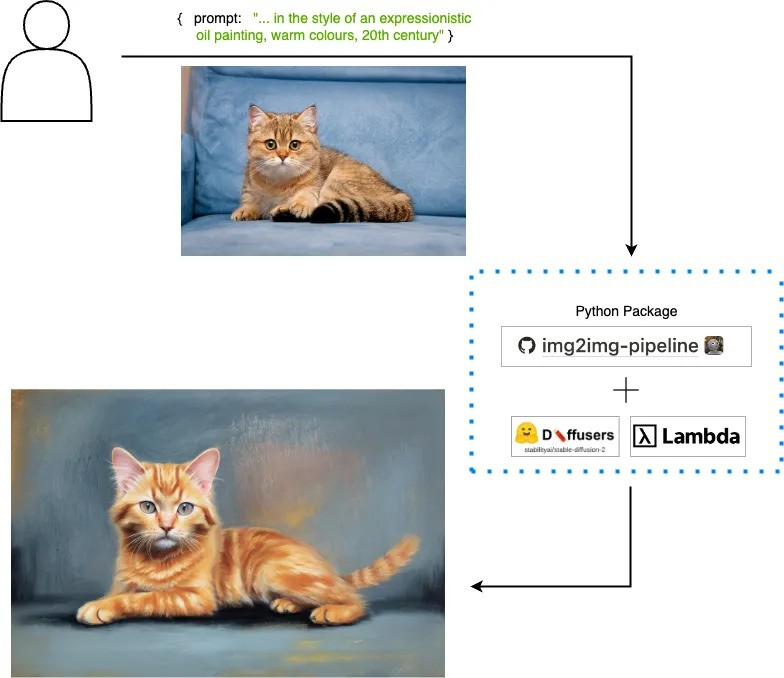

 # img2img-pipeline

Stable Diffusion img2img pipeline, supporting various models and images and 
tested on NVIDIA / CUDA devices.



This pipeline:

1. Loads images from `data/input_images` directory
2. For each image, selects a random model from `model_list` in `constants.py`.
3. Performs img2img generation for each image
4. Saves output to `data/output_images` directory

## Run it locally

**Set up python environment**

It is required to have Python3.8, CUDA, and Pytorch installed on the system

Install requirements
```
pip install -r requirements.txt
```
You must have CUDA enabled pytorch. You can check by running the following
```
import torch; print(torch.cuda.is_available())
```

**Add images to the `data/input_images` directory
```
cp example_image.png data/input_images/
```

**Run the pipeline**
Either over all the images in `data/input_images`

```
python -m src.img2img_pipeline.commands.main run_all_images_pipeline
```

Or on a specific image by providing the `[filename]` and extra arguments
```
python -m src.img2img_pipeline.commands.main run_single_image_pipeline example_image.png --prompt "in the style of picasso" --model "stabilityai/stable-diffusion-2"
```
There are a list of prompts and models in `src/constants.py`. If `--filename` or `--prompt` are not provided,
a default is chosen from the lists. In which case, the command can be simplified into
```
python -m src.img2img_pipeline.commands.main run_single_image_pipeline example_image.png
```

## Project Structure
```
.
├── README.md
├── data
│   ├── input_images
│   └── output_images
├── metrics.md
│    Metrics of the pipeline runs such as time, memory
├── requirements.txt
└── src
    └── img2img_pipeline
         Application source code
```

## Design considerations

### Code structure

All the source code sits under `src/img2img_pipeline` and uses relative paths so
it can be packaged in a pip package and integrated with any another orchestration repo
or an API service for example.

The files `model.py` and `pipeline.py` are there to provide clean levels of
abstraction and separation of responsibilities. Interfaces are defined in
`interfaces.py` to formalise these abstractions. The pipeline class can accept
any image model as long as it inherits from `ModelInterface`, as it knows that
the instance will have implemented the `predict()` function.

This carries on in making it very simple to run the pipeline as it only has to be
initialised with a model and then the `.run()` method has to be called in order
to run it. This can be seen in [commands/main.py](./src/img2img_pipeline/commands/main.py).

The current `main.py` is put inside a `commands` module because we might want to add an `api/` folder using the same modules to create a Stable Diffusion API service. Finally, The `typer` library has been used to implement the CLI command for running the pipeline as it is very simple and easily extensible.


### Work towards increasing GPU memory efficiency

1. Images are downsampled to 512px before inference and then resampled back to it's original dimensions after
inference. This is done because stable diffusion models have only been trained on 512px images or less and memory
gets exceeded very rapidly if images are higher resolution than this.

2. The pipeline has been configured to be memory efficient. The current settings are recommended from my [research](https://huggingface.co/docs/diffusers/optimization/fp16) and they are the following:
```
self.pipe.enable_attention_slicing()
self.pipe.enable_sequential_cpu_offload()
self.pipe.enable_xformers_memory_efficient_attention()
```
It was seen that installing `xformers` resulted in a significant memory boost.

This can be turned toggled using the
`memory_efficient_compute` flag in `constants.py` to see the difference in GPU utilisation. 

3. Specified `torch_dtype=torch.float16` which improved memory efficiency and speed

4. A generator function has been used to load the images one by one. If this pipeline scales to thousands of images, loading them all into memory one by one will result in exceeding available memory. Using a generator allows the pipeline to release memmory after each image is processed.

5. In `model.py` line 71 we clear the cache after every prediction
```
logger.info("clearing cache")
torch.cuda.empty_cache()
gc.collect()
```
This works to clear intermediate results, such as activations, gradients, and other temporary variables that are stored in the GPU memory or system memory. 

**Future Work**
- Research on `torch.compile`


### Work towards increasing computation speed
1. The pipeline and image generator are set to run on GPU

2. Added a fast scheduler `DPMSolverMultistepScheduler` which requires
less inference steps (~25 compared to ~50 by default).

2. Specified `torch_dtype=torch.float16` which improved memory efficiency and speed by loading the models in half precision

3. Used the TensorFloat32 (TF32) mode for faster but slightly less accurate computations
```
torch.backends.cuda.matmul.allow_tf32 = True
```

3. There is a `CACHE_DIR` specified in `constants.py`. The models are downloaded 
into `CACHE_DIR` directory and loaded from there.

**Future Work**
- figure out batch prediction with many images at once
- relying on the [sequential nature of diffusion models](https://lightning.ai/pages/community/optimize-inference-scheduler/) to run batch inference
